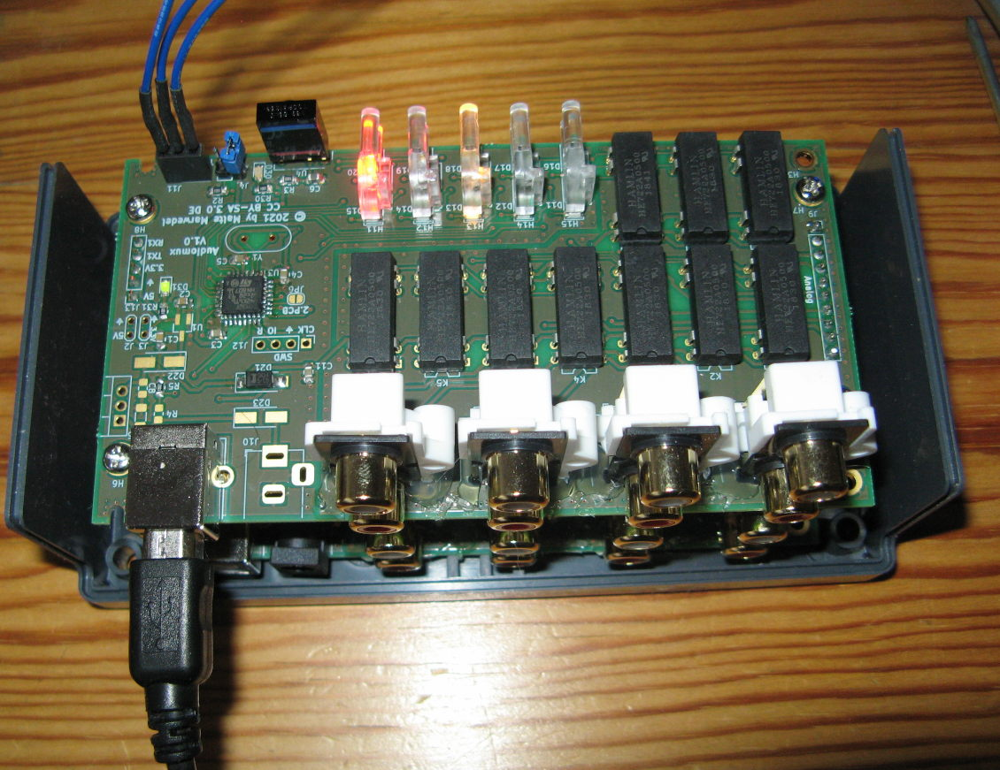

# Audiomux
This project provides a box for switching 4 stereo audio inputs to 4 outputs. Any combination of inputs to outputs can be selected at the same time.
Signal dissortion is minimized by using reed relays.
Moreover, this provides galvanic isolation from the control circuit and if the input source can drive a headphone, it will work on the output of the mux too.
Allowing control by two USB ports, this can be easily used for a homeoffice + private PC setup. Controlling with an infrared remote control is possible too.
The power supply can come from one of the USB ports or one of two external 6-12V power supplies.
For each power supply source, one predefined input to output mux configuration can be saved in the internal flash.

## Host program
A host program for communicating is provided.
Written in python, it is platform independent. Linux was tested.
Setting output 1 to input 2, call the program as following:

./audiomux-control.py 1 2

Call without parameters to get the current setup. Call

./audiomux-control.py state

to get all predefined configurations for IR remote control codes and Vcc inputs.
The input voltages and internal temperature are printed too.

A debian package can be generated.

## Compiling and uploading

There is no additional programming hardware needed.

With apt install the packages gcc-arm-none-eabi, make, dfu-util and python3-usb.

Next, call make

Then close J4 and call ./dfu-upload.sh

Later, leave J4 open to directly start the flashed program. You have to repeat this for both PCBs.

## Debugging

You can add a serial port with 3.3V level to J11 and see some debug messages when using 19200baud.

Debugging with SWD should be possible too, but this was not tested.

## TODO

The case must be milled to be useable.

## Libraries used and licenses

The software uses several open source libraries with different licenses.

The HAL library from ST is published under the BSD 3-Clause license.

Some CMSIS header files are published under the Apache 2.0 license.

The [IRMP](https://www.mikrocontroller.net/articles/IRMP_-_english) project is published under GPL 2.0 or later.

[Libusb_stm32](https://github.com/dmitrystu/libusb_stm32) is published under the Apache 2.0 license.

Since GPL 2.0 and Apache 2.0 are considered [incompatible](https://www.apache.org/licenses/GPL-compatibility.html) by the Free Software Foundation, but GPL 3.0 is considered compatible, GPL 3.0 is the only possible license for the firmware on the microcontroller side.

The PCB is under creative common license. [CC-BY-SA 3.0 DE](https://creativecommons.org/licenses/by-sa/3.0/de/deed.en)

## Windows users

The device declares itself als WCID compatible uses WinUSB.
So no driver installation is required.
You still need libusb-1.0.dll either in your system directory or in the same directory as the audiomux-control.py script.
The lib can be found [here](https://libusb.info). Tested with version 1.0.24, the dll can be found in VS2019\MS64\dll.
